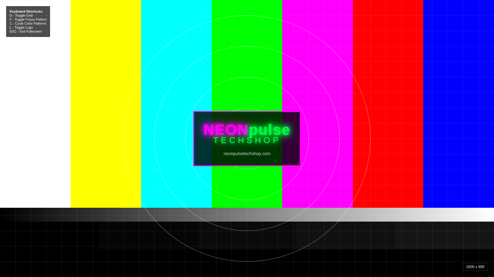
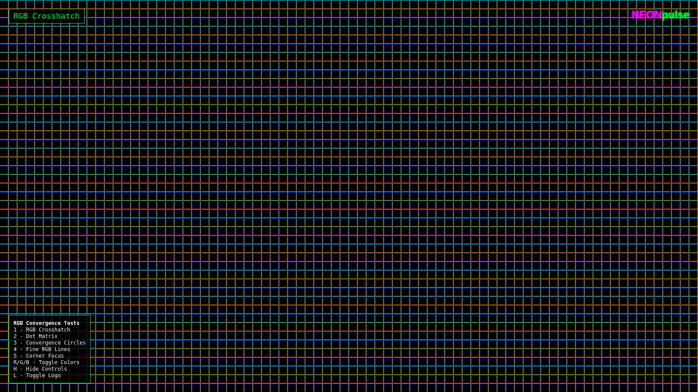
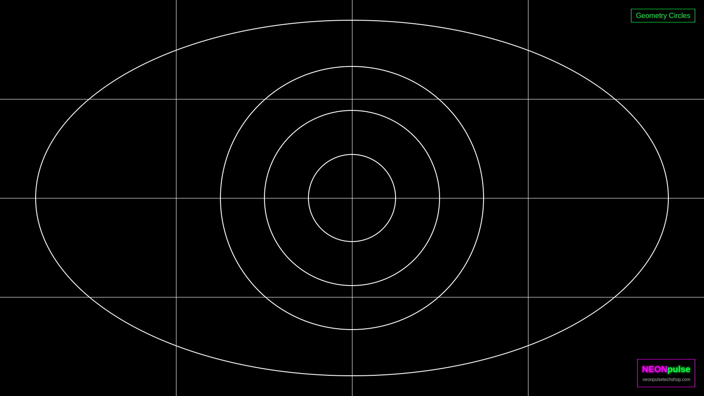
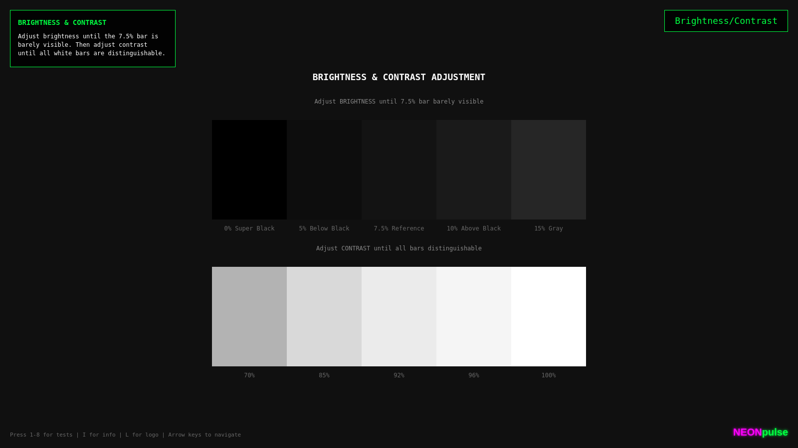
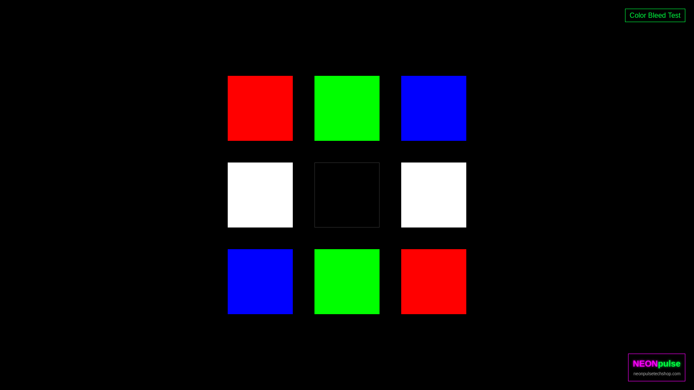
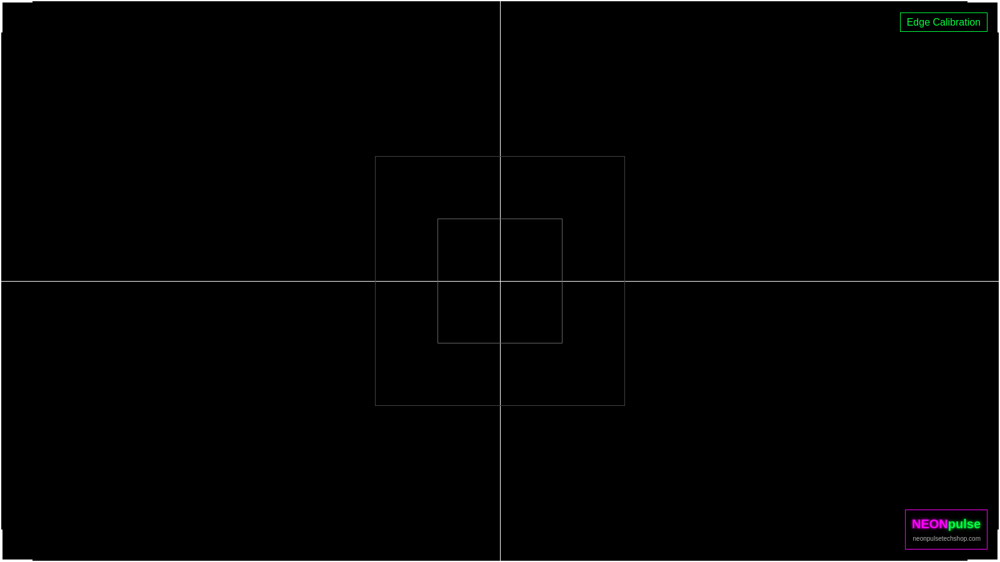
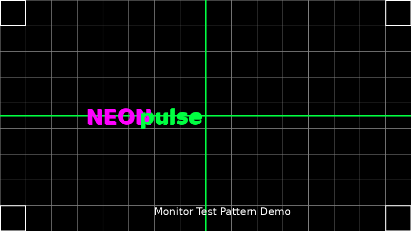

# 🖥️ NEONpulseTechshop Monitor Test Pattern Suite

<div align="center">
  


**Professional Monitor Calibration & Testing Patterns**  
*For CRT, LCD, OLED, and All Display Technologies*

[](https://opensource.org/licenses/MIT)
[](https://www.w3.org/html/)
[](https://www.python.org/)
[](https://www.microsoft.com/windows)

[**Live Demo**](#) | [**Download**](#installation) | [**Documentation**](#documentation) | [**Support**](#support)

</div>

---

## 🌟 Overview

The **NEONpulseTechshop Monitor Test Pattern Suite** is a comprehensive collection of professional-grade test patterns designed for calibrating, diagnosing, and optimizing all types of displays. Originally conceived for CRT monitor repair, this suite has evolved to support modern display technologies while maintaining its roots in precision vintage tech restoration.

### ✨ Key Features

- 🎯 **Universal Compatibility** - Works with CRT, LCD, OLED, Plasma, and emerging display technologies
- 🔧 **Professional Grade** - Industry-standard patterns used by technicians worldwide
- 💾 **Legacy Support** - Runs on Windows XP/98 and modern systems
- 🎨 **NEONpulseTechshop Branding** - Signature pink (#ff00ff) and green (#00ff41) aesthetic
- 🚀 **Zero Dependencies** - HTML patterns run in any browser
- 📦 **Standalone Executable** - Python suite compiles to portable .exe

## 📸 Screenshots

<div align="center">
<table>
  <tr>
    <td align="center" width="33%">
      
      <b>RGB Convergence Test</b>
    </td>
    <td align="center" width="33%">
      
      <b>Focus & Sharpness</b>
    </td>
    <td align="center" width="33%">
      
      <b>Geometry Calibration</b>
    </td>
  </tr>
  <tr>
    <td align="center" width="33%">
      
      <b>Brightness/Contrast PLUGE</b>
    </td>
    <td align="center" width="33%">
      
      <b>Color Bleed Detection</b>
    </td>
    <td align="center" width="33%">
      
      <b>Edge Calibration</b>
    </td>
  </tr>
</table>

[View All Screenshots →](screenshots/)
</div>

## 🎬 Demo Video

<div align="center">
  
  
  *Cycling through various test patterns in action*
</div>

## 🛠️ Test Patterns Included

### Core Calibration Tests
| Pattern | Purpose | Best For |
|---------|---------|----------|
| **SMPTE Color Bars** | Industry-standard color reference | All displays |
| **Brightness/Contrast PLUGE** | Black level and white level adjustment | All displays |
| **Grayscale Ramp** | Gamma curve verification | All displays |
| **Color Temperature** | White balance calibration | All displays |

### Geometry & Alignment (CRT-Focused)
| Pattern | Purpose | Best For |
|---------|---------|----------|
| **H/V Position** | Center image on screen | CRT |
| **H/V Size** | Adjust image dimensions | CRT |
| **Linearity Grid** | Check for geometric distortion | CRT/Projector |
| **Pincushion/Barrel** | Correct edge distortion | CRT |
| **Rotation Test** | Level horizontal alignment | CRT |

### Advanced Diagnostics
| Pattern | Purpose | Best For |
|---------|---------|----------|
| **RGB Convergence** | Align color channels | CRT |
| **Focus/Sharpness** | Optimize clarity across screen | All displays |
| **Color Bleed Test** | Detect channel interference | CRT/LCD |
| **Moiré Detection** | Identify interference patterns | CRT/LCD |
| **Dot Pitch Visualization** | See pixel/phosphor structure | All displays |

### Display Health
| Pattern | Purpose | Best For |
|---------|---------|----------|
| **Burn-in Prevention** | Moving patterns to prevent image retention | OLED/Plasma |
| **Dead Pixel Detection** | Find stuck or dead pixels | LCD/OLED |
| **Backlight Uniformity** | Check for uneven lighting | LCD |
| **Response Time Test** | Motion blur evaluation | LCD/OLED |

## 🚀 Quick Start

### HTML Test Patterns (Universal)

1. Open any `.html` file in your web browser
2. Press `F11` for fullscreen
3. Use keyboard controls:
   - `1-9` - Switch between test patterns
   - `←→` - Navigate patterns
   - `C` - Color bars
   - `R/G/B` - Pure color screens
   - `L` - Toggle logo
   - `I` - Show/hide instructions

### Python Test Suite (Advanced)

```bash
# Clone the repository
git clone https://github.com/VonHoltenCodes/monitor-test-patterns.git
cd monitor-test-patterns

# Install dependencies
pip install -r python-patterns/requirements.txt

# Run the test suite
python python-patterns/crt_test_suite.py
```

## 📦 Installation

### Option 1: Direct Download
Download the latest release from the [Releases page](https://github.com/VonHoltenCodes/monitor-test-patterns/releases)

### Option 2: Build Standalone Executable
```bash
cd python-patterns
python build_exe.py
# Find executable in dist/ folder
```

### Option 3: Use HTML Files Directly
No installation needed! Just open any HTML file in your browser.

## 📖 Documentation

### File Structure
```
monitor-test-patterns/
├── html-patterns/              # Static HTML test patterns
│   ├── crt-master-test.html   # All-in-one test suite
│   ├── rgb-convergence-test.html  # RGB-specific tests
│   ├── crt-control-test.html  # Control adjustment patterns
│   └── test-pattern-*.html    # Resolution-specific patterns
├── python-patterns/            # Dynamic Python test suite
│   ├── crt_test_suite.py      # Main application
│   ├── requirements.txt       # Dependencies
│   └── build_exe.py          # Windows executable builder
├── screenshots/               # Pattern examples
├── video/                    # Demo videos
└── README.md                 # This file
```

### Keyboard Controls Reference

#### HTML Patterns
- **Number Keys (1-9)**: Direct pattern selection
- **Arrow Keys**: Cycle through patterns
- **R, G, B**: Display pure red, green, or blue
- **W**: White screen
- **C**: SMPTE color bars
- **L**: Toggle logo visibility
- **I**: Toggle information panel
- **F11**: Enter/exit fullscreen

#### Python Suite
- **←→**: Change pattern
- **I**: Toggle info display
- **G**: Adjust grid size
- **C**: Cycle colors (purity test)
- **ESC**: Exit application

## 🔧 Advanced Usage

### Custom Resolutions

The Python suite supports custom resolutions via command line:
```python
python crt_test_suite.py --resolution 1920x1080
```

### Batch Testing

Create automated test sequences:
```python
python crt_test_suite.py --sequence "1,5,7,9" --duration 10
```

### Integration with Test Equipment

The patterns are designed to work with:
- Colorimeters (X-Rite, Datacolor)
- Oscilloscopes (for signal analysis)
- Pattern generators (for comparison)

## 🤝 Authors & Contributors

### Primary Author
**VonHoltenCodes** - *Concept originator and lead developer*
- CRT enthusiast and vintage tech restoration specialist
- Creator of the NEONpulseTechshop brand
- Professional electronics repair technician

### Co-Author & Collaborator
**Claude (Anthropic)** - *AI pair programmer*
- Pattern implementation and optimization
- Documentation and code structure
- Cross-platform compatibility testing

### Special Thanks
- The vintage computing community
- CRT repair technicians worldwide
- Open source display calibration projects
- Your mom

## 📄 License

This project is licensed under the MIT License - see the [LICENSE](LICENSE) file for details.

```
MIT License

Copyright (c) 2024 VonHoltenCodes / NEONpulseTechshop

Permission is hereby granted, free of charge, to any person obtaining a copy
of this software and associated documentation files (the "Software"), to deal
in the Software without restriction, including without limitation the rights
to use, copy, modify, merge, publish, distribute, sublicense, and/or sell
copies of the Software, and to permit persons to whom the Software is
furnished to do so, subject to the following conditions:

The above copyright notice and this permission notice shall be included in all
copies or substantial portions of the Software.
```

## 🛡️ Support

### Professional Services
For commercial calibration services or custom test pattern development:
- 🌐 Website: [neonpulsetechshop.com](https://neonpulsetechshop.com)
- 📍 Location: Shorewood, IL
- 🔧 Specialties: Monitor repair (CRT/LCD/OLED), vintage tech restoration

### Community Support
- 📝 [Report Issues](https://github.com/VonHoltenCodes/monitor-test-patterns/issues)
- 💡 [Feature Requests](https://github.com/VonHoltenCodes/monitor-test-patterns/discussions)
- 📧 Email: support@neonpulsetechshop.com

## 🚀 Roadmap

### Planned Features
- [ ] 4K/8K resolution support
- [ ] HDR test patterns
- [ ] Mobile app version
- [ ] Web-based pattern generator
- [ ] Automated calibration sequences
- [ ] Color profile export
- [ ] Multi-monitor support

### Under Consideration
- VR/AR display patterns
- MicroLED specific tests
- AI-assisted calibration
- Cloud sync for settings

## 🏆 Acknowledgments

This project stands on the shoulders of giants in the display calibration community. Special recognition to:
- SMPTE for standardized test patterns
- The Arduino/Maker community for hardware integration ideas
- Vintage computer forums for CRT expertise
- Open source projects that paved the way

---

<div align="center">
  
**Built with ❤️ for the display calibration community**

*"Perfectly calibrated displays, one pixel at a time"*

[NEONpulseTechshop](https://neonpulsetechshop.com) © 2024

</div>
