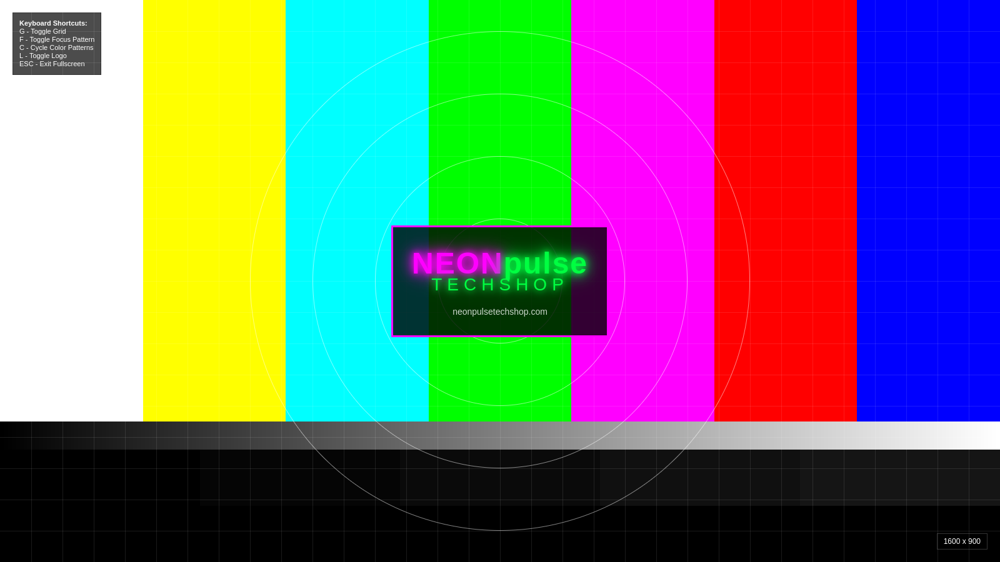

# NEONpulse CRT Convergence Pro

**Professional Monitor Calibration Suite for Windows 98/XP and CRT Displays**



## Overview

NEONpulse CRT Convergence Pro is a specialized, IE6-compatible version of the NEONpulseTechshop Monitor Test Pattern Suite, specifically designed for Windows 98 and Windows XP systems running CRT monitors. This edition focuses on the essential convergence and calibration tests needed for professional CRT repair and adjustment.

## What's Special About This Edition

- ✅ **100% IE6 Compatible** - Works flawlessly on Windows XP with Internet Explorer 6
- ✅ **Windows 98 Support** - Fully compatible with IE5 and Windows 98
- ✅ **No Modern Dependencies** - Uses only HTML 4.01 tables and basic JavaScript
- ✅ **Bootable CD-ROM** - Includes autorun.inf for automatic launch
- ✅ **Fullscreen Capable** - F11 for true fullscreen testing
- ✅ **Optimized for CRTs** - Focused on convergence, geometry, and focus testing

## Test Patterns Included

### 1. RGB Convergence Test (`convergence-simple.html`)
The most critical test for CRT monitors. Checks alignment of red, green, and blue electron beams.

**8 Patterns:**
- RGB Grid (overlapping R/G/B lines)
- White Grid
- Pure Red Screen
- Pure Green Screen
- Pure Blue Screen
- White Screen
- Black Screen
- Center Cross

### 2. Geometry Test (`geometry-test.html`)
Tests for pincushion/barrel distortion and screen alignment.

**3 Patterns:**
- Nested Squares (distortion detection)
- Grid (linearity check)
- Border + Corners (edge alignment)

### 3. Focus & Sharpness Test (`focus-test.html`)
Evaluates monitor focus across the entire screen.

**4 Patterns:**
- Horizontal Lines (50 alternating bars)
- Vertical Lines (50 alternating bars)
- Fine Grid (crosshatch pattern)
- Text Sharpness Test

### 4. Color Bars (`color-bars.html`)
Standard color calibration patterns.

**4 Patterns:**
- SMPTE Color Bars (75%)
- Full Color Bars (100%)
- RGB Bars (stacked red/green/blue)
- Grayscale Ramp (10 steps)

## How to Use

### From CD-ROM (Recommended):
1. Burn the contents of this folder to a CD-R
2. Insert CD into Windows 98/XP computer
3. Menu should auto-launch (if not, open `menu.html`)
4. Click on a test pattern
5. Press **F11** for fullscreen
6. Use **1-9 keys** to switch patterns
7. Press **F11** again to exit

### From Hard Drive:
1. Copy this folder to your computer
2. Open `menu.html` in Internet Explorer
3. Follow steps 4-7 above

## Keyboard Controls

| Key | Function |
|-----|----------|
| **F11** | Toggle fullscreen mode |
| **1-9** | Switch between patterns |
| **Arrow Keys** | Navigate patterns |
| **I** | Toggle info display |

## Technical Specifications

- **HTML Version:** 4.01 Transitional
- **Browser Support:** IE5+, Firefox 1.0+, Chrome (all versions)
- **Resolution:** Auto-scales to any resolution
- **JavaScript:** ECMAScript 3 (IE6 compatible)
- **No External Dependencies:** All patterns are self-contained

## Creating a Bootable CD

### On Linux:
```bash
mkisofs -J -R -l -V "CRT_CONVERGENCE_PRO" -o convergence-pro.iso crt-convergence-pro/
wodim -v dev=/dev/sr0 -dao speed=4 convergence-pro.iso
```

### On Windows:
1. Use ImgBurn or similar CD burning software
2. Create a data CD with all files in this folder
3. Ensure `autorun.inf` is in the root directory

## Recommended CRT Settings

For optimal testing results:
- **Resolution:** 800x600 or 1024x768
- **Refresh Rate:** 75Hz or higher (85Hz recommended)
- **Color Depth:** 32-bit True Color
- **Brightness:** 50% (adjust to preference)
- **Contrast:** 75% (adjust to preference)

## About CRT Convergence

CRT convergence is the alignment of the three electron beams (red, green, blue) so they hit the same phosphor dot on the screen. Poor convergence causes:
- Color fringing on white lines
- Blurry text
- Visible RGB separation
- Eye strain

**What to Look For:**
- RGB lines should appear as **single white lines**
- No color separation at edges
- Sharp focus corner to corner
- No geometric distortion

## License

MIT License - Copyright (c) 2024-2025 VonHoltenCodes / NEONpulseTechshop

See [LICENSE](../LICENSE) file for full details.

## Credits

**Created by:**
- **VonHoltenCodes** - CRT enthusiast and vintage tech restoration specialist
- **NEONpulseTechshop** - Professional CRT and vintage monitor repair, Shorewood, IL

**Special Thanks:**
- The vintage computing community
- CRT repair technicians worldwide
- Everyone who's kept CRT technology alive

## Support

### Professional Services:
- **Website:** [neonpulsetechshop.com](https://neonpulsetechshop.com)
- **Location:** Shorewood, IL
- **Email:** trent@neonpulsetechshop.com

### Community:
- **GitHub Issues:** [Report bugs or request features](https://github.com/VonHoltenCodes/monitor-test-patterns/issues)
- **Main Project:** [Full Monitor Test Pattern Suite](https://github.com/VonHoltenCodes/monitor-test-patterns)

---

*Built with ❤️ for the CRT restoration community*

**"Perfectly calibrated displays, one pixel at a time"**

© 2024-2025 NEONpulseTechshop
