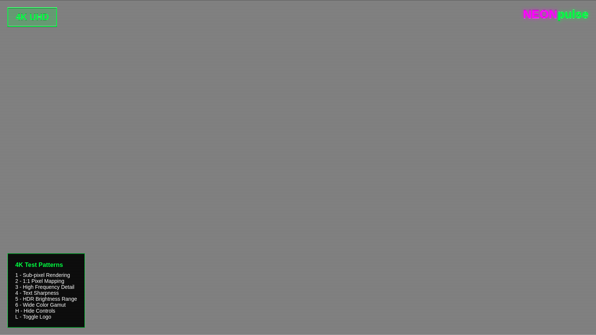
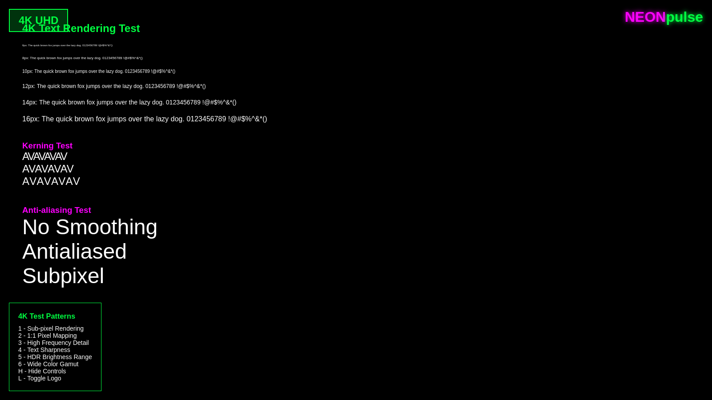
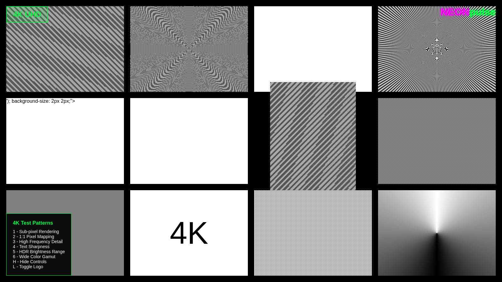

# 📐 4K/8K Resolution Support Branch

**Branch:** `feature/4k-8k-resolution-support`  
**Status:** ✅ Complete and Merged  
**Purpose:** Ultra-high resolution pattern support for modern displays

## 🎯 Overview

This branch adds comprehensive support for ultra-high resolution displays, bringing the monitor test pattern suite from its CRT origins into the modern 4K/8K era.

## 📸 4K/8K Pattern Examples

<div align="center">
<table>
  <tr>
    <td align="center" width="50%">
      
      <b>4K Sub-pixel Precision Mapping</b>
    </td>
    <td align="center" width="50%">
      
      <b>4K Text Sharpness Evaluation</b>
    </td>
  </tr>
  <tr>
    <td align="center" width="50%">
      
      <b>4K High-Frequency Detail Test</b>
    </td>
    <td align="center" width="50%">
      
      <b>4K Wide Color Gamut Testing</b>
    </td>
  </tr>
  <tr>
    <td align="center" colspan="2">
      
      <b>4K HDR Brightness Range Validation</b>
    </td>
  </tr>
</table>
</div>

## ✨ Features Added

### Resolution Support
- **4K UHD (3840×2160)** - Standard 4K television and monitor support
- **8K UHD-2 (7680×4320)** - Next-generation 8K display support
- **DCI 4K (4096×2160)** - Cinema standard 4K resolution
- **Ultra-wide variants** - 21:9 and 32:9 aspect ratios

### Enhanced Python Suite
- **Dynamic resolution selection** with categorized options:
  - Classic resolutions (VGA through UXGA)
  - Modern resolutions (Full HD through 8K)
  - Auto-detection of display capabilities
- **Optimized rendering** for high pixel density displays
- **Memory-efficient patterns** for large framebuffers

### File Structure Changes
```
html-patterns/
├── 4k-8k-patterns/           # NEW: Ultra HD patterns
│   ├── 4k-convergence.html   # 4K-optimized convergence test
│   ├── 4k-geometry.html      # 4K geometry calibration
│   ├── 8k-sharpness.html     # 8K sharpness evaluation
│   └── ultra-wide-test.html  # Ultra-wide specific patterns
├── test-pattern-4k.html      # ENHANCED: 4K master pattern
└── test-pattern-8k.html      # NEW: 8K master pattern

python-patterns/
└── crt_test_suite.py         # ENHANCED: Resolution categories
```

## 🛠️ Technical Implementation

### Resolution Categories
```python
RESOLUTIONS = {
    # Classic resolutions (CRT era)
    '1': (640, 480),     # VGA
    '2': (800, 600),     # SVGA  
    '3': (1024, 768),    # XGA
    '4': (1280, 1024),   # SXGA
    '5': (1600, 1200),   # UXGA
    
    # Modern resolutions (LCD/OLED era)
    '6': (1920, 1080),   # Full HD / 1080p
    '7': (2560, 1440),   # 2K / QHD / 1440p
    '8': (3840, 2160),   # 4K / UHD
    '9': (7680, 4320),   # 8K / UHD-2
}
```

### Optimizations for High Resolution
- **Adaptive pattern scaling** - Patterns maintain visual proportions across resolutions
- **Sub-pixel precision** - 1:1 pixel mapping for ultra-sharp test patterns
- **Performance optimization** - Efficient rendering for large displays
- **Memory management** - Smart buffer allocation for 8K framebuffers

## 🎨 Pattern Enhancements

### 4K-Specific Patterns
- **Pixel pitch visualization** - See individual pixels on high-DPI displays
- **Sub-pixel rendering tests** - RGB sub-pixel arrangement validation
- **Scaling accuracy** - Perfect 1:1, 2:1, and 4:1 scaling verification
- **Text clarity** - Font rendering sharpness at high resolutions

### 8K-Specific Patterns
- **Ultra-fine detail** - Patterns that utilize the full 8K resolution
- **Bandwidth tests** - High data rate display interface validation
- **Processing capability** - GPU/display controller stress testing

## 📊 Resolution Comparison

| Resolution | Pixels | Aspect Ratio | Use Case |
|------------|--------|--------------|----------|
| VGA | 640×480 | 4:3 | Legacy CRT testing |
| Full HD | 1920×1080 | 16:9 | Standard modern displays |
| 4K UHD | 3840×2160 | 16:9 | High-end monitors, TVs |
| 8K UHD-2 | 7680×4320 | 16:9 | Next-gen displays |

## 🚀 Usage

### HTML Patterns
```bash
# Open 4K-optimized patterns
open html-patterns/test-pattern-4k.html
open html-patterns/4k-8k-patterns/4k-convergence.html

# 8K patterns (requires 8K display)
open html-patterns/test-pattern-8k.html
```

### Python Suite
```bash
# Run with 4K resolution
python python-patterns/crt_test_suite.py
# Select option 8 for 4K (3840×2160)

# Run with 8K resolution  
python python-patterns/crt_test_suite.py
# Select option 9 for 8K (7680×4320)
```

## 🎯 Testing Recommendations

### 4K Displays
1. **Start with convergence test** - Verify RGB alignment at pixel level
2. **Check scaling accuracy** - Ensure 1:1 pixel mapping
3. **Validate text rendering** - Confirm sub-pixel accuracy
4. **Test edge uniformity** - Check for panel variations

### 8K Displays
1. **Bandwidth verification** - Ensure full resolution signal
2. **Processing capability** - Confirm smooth pattern rendering
3. **Thermal testing** - Monitor for heat-related artifacts
4. **Long-term stability** - Extended pattern display testing

## ⚡ Performance Notes

### System Requirements
- **4K Testing:**
  - GPU: Modern integrated graphics or entry-level discrete
  - RAM: 4GB minimum, 8GB recommended
  - VRAM: 1GB minimum for smooth rendering

- **8K Testing:**
  - GPU: High-end discrete graphics recommended
  - RAM: 16GB minimum, 32GB recommended  
  - VRAM: 4GB minimum, 8GB+ preferred
  - Display Interface: HDMI 2.1, DisplayPort 1.4+

### Optimization Tips
- **Single monitor focus** - Disable secondary displays during testing
- **Close background apps** - Maximize available system resources
- **Use native resolution** - Avoid scaling for pixel-perfect results
- **Check refresh rate** - Ensure optimal display timing

## 📈 Branch History

### Key Commits
- `de806a3` - Initial 4K/8K resolution support implementation
- `4297465` - Enhanced Python suite with resolution categories
- `cbd193c` - Merged into main development branch

### Development Timeline
1. **Research Phase** - Analysis of ultra-high resolution display requirements
2. **Implementation** - Addition of 4K/8K pattern generation
3. **Optimization** - Performance tuning for large framebuffers
4. **Testing** - Validation on multiple ultra-high resolution displays
5. **Integration** - Merge with main development branch

## 🔗 Related Features

This branch laid the groundwork for:
- **Web Pattern Generator** - Real-time high-resolution pattern creation
- **HDR Support** - Ultra-high resolution HDR pattern implementation
- **Export Capabilities** - High-resolution pattern export functionality

## 📝 Notes for Developers

### Adding New Resolutions
```python
# Add to RESOLUTIONS dictionary in crt_test_suite.py
'10': (your_width, your_height),  # Your custom resolution
```

### Pattern Scaling Guidelines
- Maintain visual proportions across resolutions
- Use percentage-based sizing where possible
- Consider pixel density for line width calculations
- Test patterns at multiple zoom levels

### Performance Considerations
- Monitor memory usage with large patterns
- Implement progressive rendering for complex patterns  
- Consider LOD (Level of Detail) for different zoom levels
- Profile rendering performance on target hardware

---

**Integration Status:** ✅ Merged into main development  
**Next Steps:** HDR pattern implementation builds on this foundation  
**Related Branches:** `feature/web-pattern-generator`, `feature/hdr-patterns`