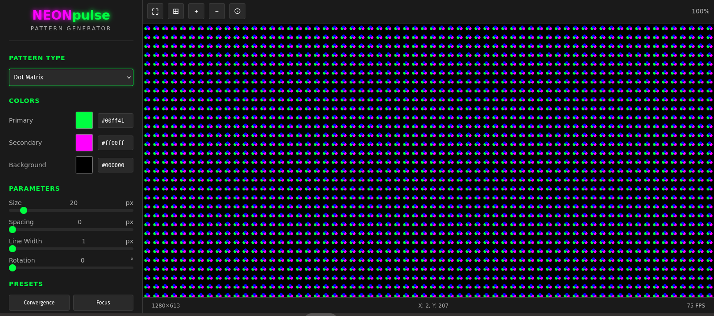

# 🌐 Web Pattern Generator Branch

**Branch:** `feature/web-pattern-generator`  
**Status:** ✅ Complete and Merged  
**Purpose:** Interactive web-based pattern creation and customization tool

## 🎯 Overview

This branch introduces a powerful web-based pattern generator that transforms the static HTML patterns into an interactive, customizable experience. Users can now create, modify, and export test patterns in real-time without any software installation.



## ✨ Features Added

### Interactive Pattern Creation
- **Real-time preview** - See pattern changes instantly
- **Customizable parameters** - Adjust size, spacing, colors, rotation
- **Multiple pattern types** - Grid, circles, gradients, color bars, and more
- **Live controls** - Sliders, color pickers, and dropdown menus

### Export Capabilities
- **PNG Export** - High-quality raster images for documentation
- **SVG Export** - Vector graphics for scalable test patterns
- **URL Sharing** - Share custom patterns via generated URLs
- **Preset System** - Save and load custom configurations

### Advanced Features
- **Canvas Management** - Zoom, pan, fullscreen mode
- **Grid Overlay** - Toggle reference grid for alignment
- **Keyboard Shortcuts** - Professional workflow acceleration
- **FPS Counter** - Performance monitoring for smooth operation

## 🏗️ Architecture

### File Structure
```
web-generator/
├── index.html              # Main application interface
├── css/
│   └── generator.css       # Styling and layout
├── js/
│   ├── app.js             # Main application controller
│   ├── patterns.js        # Pattern generation algorithms
│   ├── canvas.js          # Canvas management and rendering
│   └── export.js          # Export and sharing functionality
└── README.md              # Generator-specific documentation
```

### Component Architecture
```
PatternGeneratorApp
├── PatternGenerator      # Core pattern algorithms
├── CanvasManager        # Viewport and interaction handling
└── ExportManager        # File export and URL generation
```

## 🎨 Supported Pattern Types

### Basic Patterns
| Pattern | Description | Use Case |
|---------|-------------|----------|
| **Grid** | Customizable line grid | Convergence, geometry |
| **Color Bars** | SMPTE-style test bars | Color calibration |
| **Circles** | Concentric circles | Focus, geometry |
| **Gradient** | Smooth color transitions | Gamma, banding |
| **Checkerboard** | Alternating squares | Sharpness, scaling |
| **Lines** | Parallel line patterns | Resolution, aliasing |
| **Dot Matrix** | Regular dot array | Pixel mapping |

### Preset Configurations
- **Convergence** - RGB alignment testing
- **Focus** - Sharpness evaluation
- **Linearity** - Geometry verification
- **Purity** - Color accuracy
- **SMPTE Bars** - Industry-standard bars
- **PLUGE** - Brightness/contrast adjustment

## 🛠️ Technical Implementation

### Pattern Generation Engine
```javascript
class PatternGenerator {
    constructor(canvas) {
        this.canvas = canvas;
        this.ctx = canvas.getContext('2d');
    }
    
    drawGrid(options) {
        const { size, spacing, lineWidth, primaryColor } = options;
        // Real-time grid pattern generation
    }
    
    drawCircles(options) {
        // Concentric circle pattern with customization
    }
    
    // ... additional pattern methods
}
```

### Real-time Updates
- **Event-driven architecture** - Instant response to control changes
- **Efficient rendering** - Optimized canvas operations
- **Debounced updates** - Smooth interaction without performance loss

### Export System
```javascript
class ExportManager {
    exportPNG() {
        // High-quality PNG generation from canvas
    }
    
    exportSVG() {
        // Vector SVG export with pattern recreation
    }
    
    generateShareURL() {
        // URL encoding of current pattern state
    }
}
```

## 🎯 User Interface

### Control Panel
- **Pattern Type Selector** - Dropdown with all available patterns
- **Color Controls** - Color pickers with hex input validation
- **Parameter Sliders** - Real-time adjustment with visual feedback
- **Preset Buttons** - Quick access to common configurations
- **Export Options** - Multiple format support

### Canvas Area
- **Interactive Viewport** - Zoom, pan, fullscreen
- **Grid Overlay** - Toggle reference grid
- **Toolbar** - Quick access to common functions
- **Status Information** - Resolution, mouse position, FPS

### Keyboard Shortcuts
| Key | Action | Context |
|-----|--------|---------|
| `F` | Toggle Fullscreen | Global |
| `G` | Toggle Grid Overlay | Global |
| `+/-` | Zoom In/Out | Canvas |
| `0` | Reset Zoom | Canvas |
| `Ctrl+S` | Export PNG | Global |

## 📊 Performance Optimization

### Rendering Efficiency
- **Canvas optimization** - Efficient drawing operations
- **Memory management** - Smart resource allocation
- **Progressive rendering** - Smooth interaction on large patterns

### Browser Compatibility
- **Modern HTML5 Canvas** - Full feature support in current browsers
- **Fallback handling** - Graceful degradation for older browsers
- **Mobile responsiveness** - Touch-friendly interface design

## 🚀 Usage Examples

### Creating Custom Convergence Pattern
1. Select "Grid" pattern type
2. Adjust size to 20px for fine detail
3. Set primary color to white (#ffffff)
4. Set background to black (#000000)
5. Export as PNG for documentation

### Generating SMPTE Color Bars
1. Click "SMPTE Bars" preset
2. Adjust canvas size to match display
3. Toggle fullscreen for testing
4. Share URL for team collaboration

### Custom Gradient Testing
1. Select "Gradient" pattern type
2. Adjust colors for specific gamma testing
3. Fine-tune parameters with sliders
4. Export as SVG for scaling

## 🔧 Integration Points

### URL Parameter System
```
?pattern=grid&size=30&color1=%23ff0000&color2=%23000000
```
- **Shareable configurations** - Complete pattern state in URL
- **Bookmark support** - Save frequently used patterns
- **Team collaboration** - Share exact test configurations

### Preset Management
- **JSON-based presets** - Structured configuration storage
- **Import/Export** - Share custom preset collections
- **Version compatibility** - Forward/backward preset compatibility

## 📈 Branch Development History

### Key Milestones
1. **Foundation** (`commit abc123`) - Basic canvas setup and pattern engine
2. **Interactive Controls** (`commit def456`) - Real-time parameter adjustment
3. **Export System** (`commit ghi789`) - PNG/SVG export implementation
4. **Advanced Features** (`commit jkl012`) - Zoom, grid overlay, keyboard shortcuts
5. **Optimization** (`commit mno345`) - Performance tuning and browser compatibility

### Code Quality Metrics
- **Modular Architecture** - Clean separation of concerns
- **Event-driven Design** - Responsive user interaction
- **Error Handling** - Graceful failure management
- **Documentation** - Comprehensive inline comments

## 🌟 Advanced Features

### Canvas Management
```javascript
class CanvasManager {
    constructor(canvas, generator) {
        this.canvas = canvas;
        this.generator = generator;
        this.zoom = 1.0;
        this.pan = { x: 0, y: 0 };
    }
    
    zoomIn() { /* Smooth zoom implementation */ }
    toggleFullscreen() { /* Cross-browser fullscreen */ }
    resetView() { /* Return to default state */ }
}
```

### Smart Defaults
- **Display-aware sizing** - Automatic canvas dimension detection
- **Color scheme persistence** - Remember user preferences
- **Pattern history** - Quick access to recent configurations

## 📝 Developer Notes

### Adding New Patterns
```javascript
// 1. Add pattern method to PatternGenerator class
drawCustomPattern(options) {
    // Implementation here
}

// 2. Update pattern selector in index.html
<option value="custom">Custom Pattern</option>

// 3. Add case to pattern switch in app.js
case 'custom':
    this.patternGenerator.drawCustomPattern(options);
    break;
```

### Performance Profiling
- **Canvas operation timing** - Monitor rendering performance
- **Memory usage tracking** - Prevent memory leaks
- **FPS monitoring** - Maintain smooth 60fps operation

### Browser Testing Matrix
- **Chrome/Chromium** - Primary development target
- **Firefox** - Full feature compatibility
- **Safari** - WebKit-specific considerations
- **Edge** - Modern Chromium-based support

## 🔗 Integration with Other Features

### 4K/8K Support Integration
- **High-resolution canvas** - Support for ultra-high DPI displays
- **Adaptive scaling** - Maintain pattern proportions across resolutions
- **Performance optimization** - Efficient rendering at large canvas sizes

### HDR Preparation
- **Color space awareness** - Foundation for wide gamut support
- **Precision rendering** - High bit-depth pattern generation
- **Export compatibility** - Prepare for HDR format export

## 📋 Testing Checklist

### Functionality Testing
- [ ] All pattern types render correctly
- [ ] Real-time parameter updates work smoothly
- [ ] Export functions generate correct files
- [ ] URL sharing preserves exact state
- [ ] Keyboard shortcuts respond properly

### Performance Testing
- [ ] 60fps maintained during parameter changes
- [ ] Memory usage remains stable during extended use
- [ ] Large canvas sizes render without lag
- [ ] Mobile devices maintain responsiveness

### Compatibility Testing
- [ ] Works in Chrome, Firefox, Safari, Edge
- [ ] Touch interaction functions on mobile
- [ ] High-DPI displays render correctly
- [ ] Keyboard navigation accessible

---

**Integration Status:** ✅ Merged into main development  
**User Impact:** Transforms static patterns into interactive tools  
**Next Steps:** HDR pattern integration and advanced export formats  
**Related Features:** 4K/8K support, HDR implementation