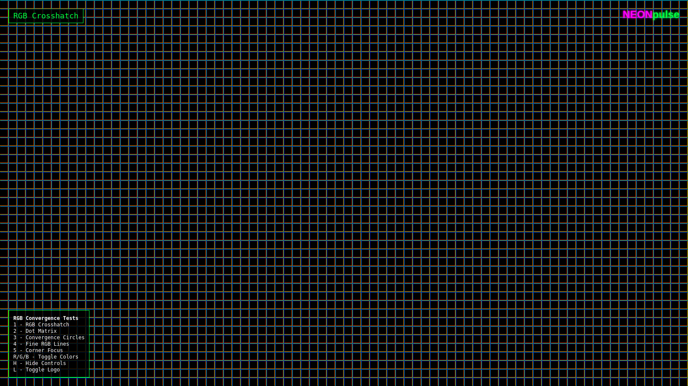
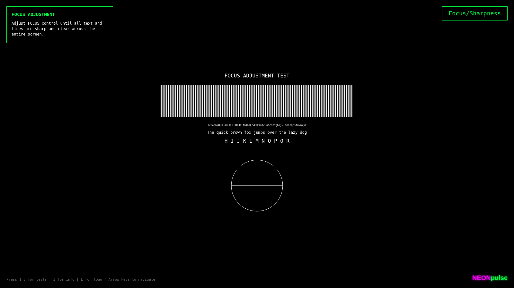
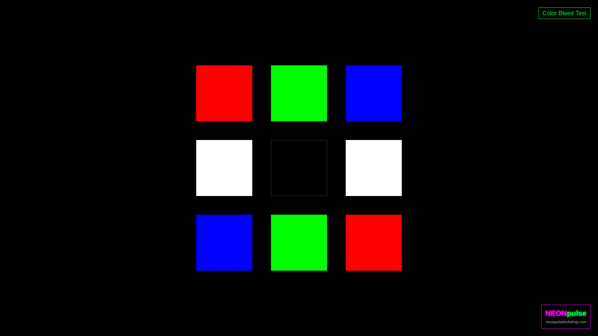

# 📸 Screenshot Gallery

## Pattern Overview

This gallery showcases all available test patterns in the NEONpulseTechshop Monitor Test Pattern Suite.

---

## Main Test Interface

### NEONpulseTechshop Branding

*The signature pink and green branding displayed on test patterns*

---

## Position & Geometry Tests

### H/V Position Test

*Centering guides for horizontal and vertical position adjustment*

### Position Test (Alternative)

*Cross-hair pattern for precise centering*

### Edge Calibration

*Corner markers and border for overscan adjustment*

### H-Size/V-Size

*Size adjustment reference with percentage markers*

### Linearity

*Grid pattern to check for geometric distortion*

### Pincushion/Barrel

*Straight line grid for pincushion and barrel distortion*

### Rotation

*Horizontal reference lines for rotation adjustment*

### Geometry Circles

*Concentric circles for overall geometry check*

---

## Convergence & RGB Tests

### RGB Crosshatch

*Separated RGB grids for convergence alignment*

### RGB Separation

*RGB line separation test for color channel alignment*

### Convergence Circles

*RGB-separated circles for convergence testing*

### Convergence Dots

*Dot matrix pattern for fine convergence adjustment*

### Dot Matrix

*RGB dot pattern for pixel-level convergence*

### Corner Focus

*Corner and center targets for focus uniformity*

### Fine RGB Lines

*Fine horizontal RGB lines for convergence*

---

## Image Quality Tests

### Focus/Sharpness

*Line patterns and text for focus adjustment*

### Focus Test (Alternative)

*Comprehensive focus test with various elements*

### Fine Grid

*Fine grid pattern for overall sharpness check*

### Color Bleed Test

*Color squares to detect channel bleeding*

---

## Calibration Tests

### Brightness/Contrast

*PLUGE pattern for black level and contrast adjustment*

### Brightness Uniformity

*Gray field with reference squares for uniformity*

### Color Temperature

*White and gray bars for color temperature adjustment*

---

## Usage Tips

1. **Full Screen**: Always view patterns in fullscreen (F11) for accurate testing
2. **Room Lighting**: Dim room lights to reduce glare and improve contrast perception
3. **Warm-up Time**: Allow CRT monitors 15-30 minutes to warm up before critical adjustments
4. **Distance**: View from normal operating distance for best results

## Pattern Selection Guide

### For New Monitor Setup:
1. Start with **Edge Calibration** to ensure full image visibility
2. Use **H/V Position** to center the image
3. Check **Linearity** and **Geometry** patterns
4. Fine-tune with **Convergence** tests (CRT only)
5. Finish with **Brightness/Contrast** calibration

### For Quick Checks:
- **Focus Test** - Quick sharpness verification
- **Color Bleed Test** - Channel separation check
- **Brightness Uniformity** - Backlight/phosphor uniformity

### For Professional Calibration:
- Use all patterns in sequence
- Document settings for each adjustment
- Re-verify after each major change